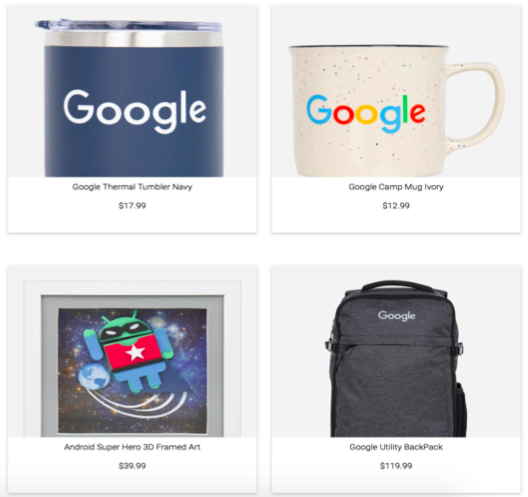

# Google Analytics Customer Revenue Prediction

## **Project summary**:

In this project, we focused on analyzing the Google Merchandise Store (also known as G Store, where Google Swags are sold, including T-shirts, water bottles, notebooks and etc.) to predict some information related to transaction revenue. Products are priced in local currencies and the price range is between $0.99 and $99.9.

We collected our dataset from Google Customer Revenue Competition on Kaggle. We found that train set included 903653 observations with 36 variables and test set contained 804684 observations. Except for dependent variable transaction revenue, we can divide other variables into 6 groups: Visitor Info, Visitor Num, Channel Grouping, Device, Geo Networks, and Advertisement.

Our main objective is to predict transaction revenue for the following 60 days and to predict transaction revenue based on each customer visiting Google Store. Before selecting models, we would perform a detailed Exploratory Data Analysis. After that, we would break down our research question into three parts.

Firstly, we plan to forecast daily transaction revenue by using a time series SARIMA model. Secondly, we will classify whether a customer is going to purchase some products. For this part, we will implement the logistic regression, random forests and XGBoost classification models. The final part is to predict the total revenue a customer is going to make by using regression models. We will use Linear Mixed Models and Boosting methods such as XGBoost regression.

